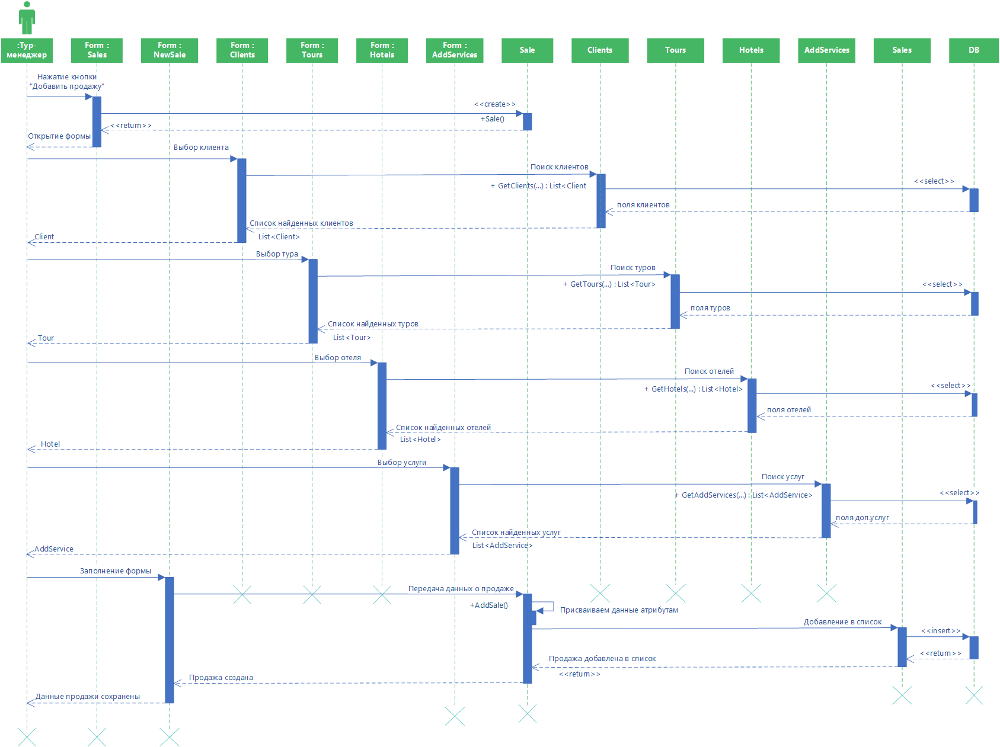
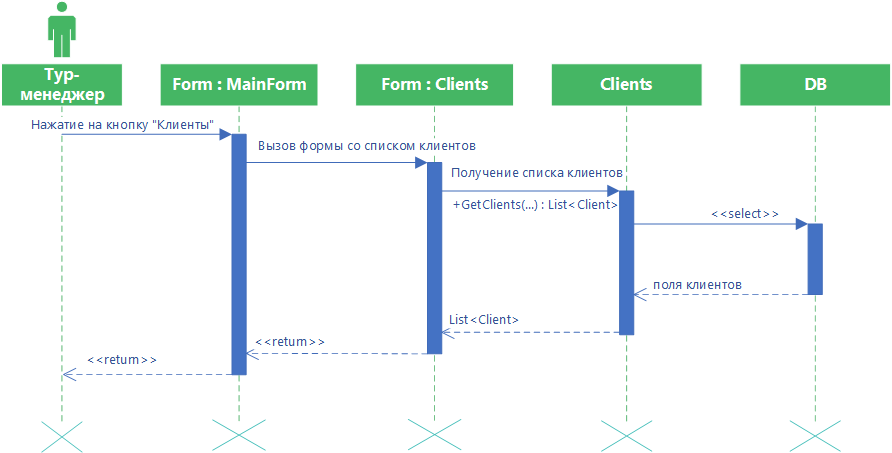

# Туристическая компания Avail
## Назначение программы:
Целью создания информационной системы является автоматизация процессов, происходящих в туристической компании.
В ходе эксплуатации планируется решить следующие задачи:
-	упрощение процесса продажи путевок;
-	формирование информационной базы;
-	контроль над финансовой деятельностью компании;
-	проведение анализа деятельности туристической компании;
-	оптимизировать функционирование туристической компании в целом;

## Диаграмма классов

### Список классов

- [Sale](docs/Classes/Sale.md "Класс Sale")
- [Person](docs/Classes/Person.md "Класс Person")
- [Client](docs/Classes/Client.md "Класс Client")
- [Employee](docs/Classes/Employee.md "Класс Employee")
- [Tourist](docs/Classes/Tourist.md "Класс Tourist")
- [Tour](docs/Classes/Tour.md "Класс Tour")
- [TourDatesPrice](docs/Classes/TourDatesPrice.md "Класс TourDatesPrice")
- [Hotel](docs/Classes/Hotel.md "Класс Hotel")
- [HotelRoom](docs/Classes/HotelRoom.md "Класс HotelRoom")
- [City](docs/Classes/City.md "Класс City")
- [AddService](./docs/Classes/AddService.md "Класс AddService")
- [Result](docs/Classes/Result.md "Класс Result")
- [DocumentType](docs/Classes/DocumentType.md "Enum интерфейс DocumentType")
- [FlightClass](docs/Classes/FlightClass.md "Enum интерфейс FlightClass")
- [FirstTypeOfRoom](docs/Classes/FirstTypeOfRoom.md "Enum интерфейс FirstTypeOfRoom")
- [SecondTypeOfRoom](docs/Classes/SecondTypeOfRoom.md "Enum интерфейс SecondTypeOfRoom")

## Диаграмма интерфейсов

### Список интерфейсов

- [ISale](docs/Interfaces/ISale.md "Интерфейс ISale")
- [IClient](docs/Interfaces/IClient.md "Интерфейс IClient")
- [IEmployee](docs/Interfaces/IEmployee.md "Интерфейс IEmployee")
- [ITourist](docs/Interfaces/ITourist.md "Интерфейс ITourist")
- [ITour](docs/Interfaces/ITour.md "Интерфейс ITour")
- [ITourDatesPrice](docs/Interfaces/ITourDatesPrice.md "Интерфейс ITourDatesPrice")
- [IHotel](docs/Interfaces/IHotel.md "Интерфейс IHotel")
- [IHotelRoom](docs/Interfaces/IHotelRoom.md "Интерфейс IHotelRoom")
- [ICity](docs/Interfaces/ICity.md "Интерфейс ICity")
- [IAddService](./docs/Interfaces/IAddService.md "Интерфейс IAddService")

## Диаграммы последовательностей

### Добавление продажи

Диаграмма описывает процесс добавления продажи. Тур-менеджер нажимает на форме продаж кнопку “Добавить продажу”, открывается форма добавления новой продажи. Пользователь выбирает клиента: открывается форма поиска клиента, из класса «Clients» возвращается клиент, соответствующий критериям поиска. Выбор тура: открывается форма поиска тура, из класса «Tours» возвращается тур, соответ-ствующий критериям поиска. Выбор отеля: открывается форма поиска отеля, из класса «Hotels» возвращается отель, соответствующий критериям поиска. Выбор доп.услуг: открывается форма поиска доп.услуг, из класса «AddServices» возвраща-ется доп.услуга, соответствующая критериям поиска. После заполнения формы и нажатия на кнопку «Сохранить», классу Sale присваиваются атрибуты и Sale добав-ляется в список Sales.

### Авторизация

Диаграмма описывает процесс авторизации пользователя. Тур-менеджер нажимает на форме авторизации кнопку “Вход”. Затем выполняется функция получения списка пользователей с введенным логином и паролем. Если поль-зователь найден, то вход выполнен успешно.

### Просмотр списка клиентов

Диаграмма описывает процесс просмотра списка клиентов. Пользователь нажимает на главной форме кнопку “Клиенты”, затем вызывается форма спис-ка клиентов, в которой выполняется функция получения списка клиентов.

### Изменение данных клиента

Диаграмма описывает процесс изменения данных клиента. Тур-менеджер выбирает из списка нужного пользователя, что вызывает открытие формы просмотра данных клиента. Тур-менеджер нажимает на кнопку “Изменить”. Вызывается форма измене-ния клиента. Затем пользователь изменяет данные о клиенте. Происходит присвоение данных полям класса, после чего вызывается функция EditClient(). При успешном обновлении данных выводится сообщение, что данные о клиенте изменены.

### Удаление клиента

Диаграмма описывает процесс удаление данных клиента. Тур-менеджер выбирает из списка нужного пользователя, что вызывает открытие формы просмотра данных клиента. Тур-менеджер нажимает на кнопку “Удалить”. Затем вызывается функция DelClient() для удаления клиента из программы. При успешном выполнении выво-дится сообщение, что клиент удален.

## Диаграммы действий

### Общая диаграмма действий

Диаграмма описывает деятельность тур-менеджеров. После авторизации для тур-менеджера выводится пользовательский интерфейс, где он может выбрать нуж-ный раздел. После выбора раздела выводится список объектов (в зависимости от вы-бора раздела). Менеджер может создать новый город, редактировать его или уда-лить, просматривать связанные с ним списки. Те же самые действия он может делать с другими объектами. Диаграмма для других пользователей системы будет выгля-деть подобным образом, имея различия в доступе к разделам. Но стоит обратить особое внимание на действия при добавлении продажи, так как действия в этом слу-чае представляются в отличном от обычного добавления (например, клиента).

### Добавление продажи
")

Диаграмма действий описывает добавление продажи. После открытия формы добавления продажи пользователь может заполнить данные в любом порядке (данные о клиенте, туре, отеле, доп.услугах и пр.). После заполнения полей пользователь может нажать на кнопку «Сохранить» или «Отменить».

## Диаграмма состояний 

### Диаграмма состояний продажи

Диаграмма описывает все возможные состояния продажи на продолжении ее жиз-ненного цикла. Исходная продажа является пустой, далее, после добавления кли-ента, добавления тура, добавления отеля, добавления доп.услуг, определяется стоимость. После подтверждения всех аспектов продажа переходит в состояние «Продана». После этого она может быть удалена.