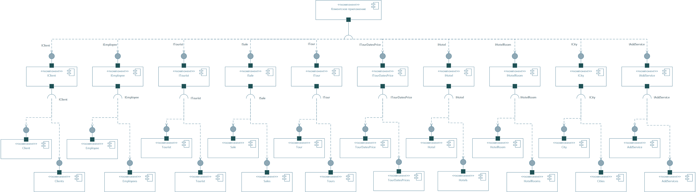

# Диаграмма компонентов

На данной диаграмме изображены все компоненты: клиентское приложение, клиенты, сотрудники, продажи, туры, вариации туров, отели, номера отелей, города, доп.услуги. Эти компоненты взаимодействуют друг с другом с помощью интерфейсов. 