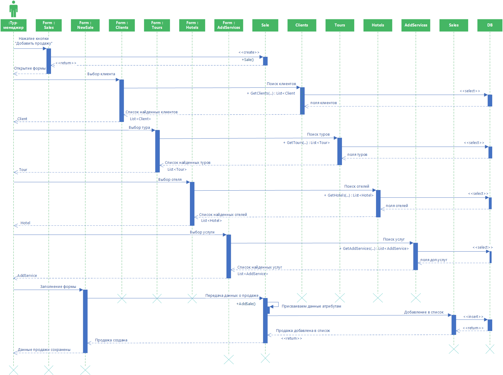

# Добавление продажи

Диаграмма описывает процесс добавления продажи. Тур-менеджер нажимает на форме продаж кнопку “Добавить продажу”, открывается форма добавления новой продажи. Пользователь выбирает клиента: открывается форма поиска клиента, из класса «Clients» возвращается клиент, соответствующий критериям поиска. Выбор тура: открывается форма поиска тура, из класса «Tours» возвращается тур, соответ-ствующий критериям поиска. Выбор отеля: открывается форма поиска отеля, из класса «Hotels» возвращается отель, соответствующий критериям поиска. Выбор доп.услуг: открывается форма поиска доп.услуг, из класса «AddServices» возвраща-ется доп.услуга, соответствующая критериям поиска. После заполнения формы и нажатия на кнопку «Сохранить», классу Sale присваиваются атрибуты и Sale добав-ляется в список Sales.