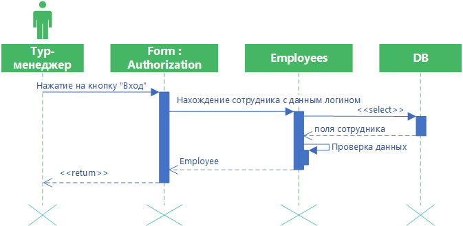

# Авторизация

Диаграмма описывает процесс авторизации пользователя. Тур-менеджер нажимает на форме авторизации кнопку “Вход”. Затем выполняется функция получения списка пользователей с введенным логином и паролем. Если поль-зователь найден, то вход выполнен успешно.