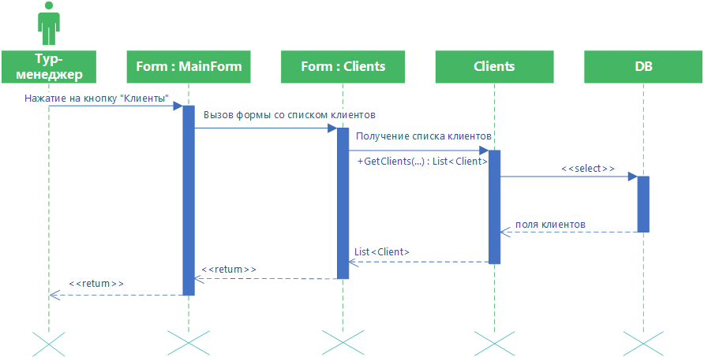

# Просмотр списка клиентов

Диаграмма описывает процесс просмотра списка клиентов. Пользователь нажимает на главной форме кнопку “Клиенты”, затем вызывается форма спис-ка клиентов, в которой выполняется функция получения списка клиентов.