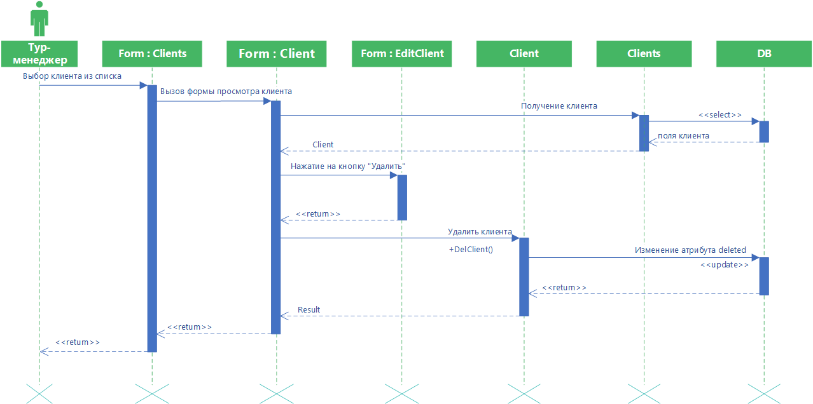

# Удаление клиента

Диаграмма описывает процесс удаление данных клиента. Тур-менеджер выбирает из списка нужного пользователя, что вызывает открытие формы просмотра данных клиента. Тур-менеджер нажимает на кнопку “Удалить”. Затем вызывается функция DelClient() для удаления клиента из программы. При успешном выполнении выво-дится сообщение, что клиент удален.