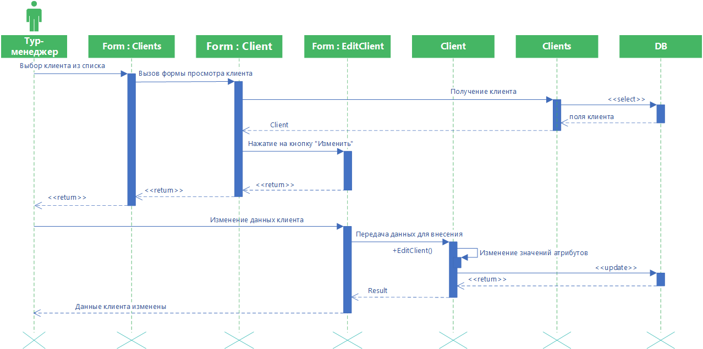

# Изменение данных клиента

Диаграмма описывает процесс изменения данных клиента. Тур-менеджер выбирает из списка нужного пользователя, что вызывает открытие формы просмотра данных клиента. Тур-менеджер нажимает на кнопку “Изменить”. Вызывается форма измене-ния клиента. Затем пользователь изменяет данные о клиенте. Происходит присвоение данных полям класса, после чего вызывается функция EditClient(). При успешном обновлении данных выводится сообщение, что данные о клиенте изменены.