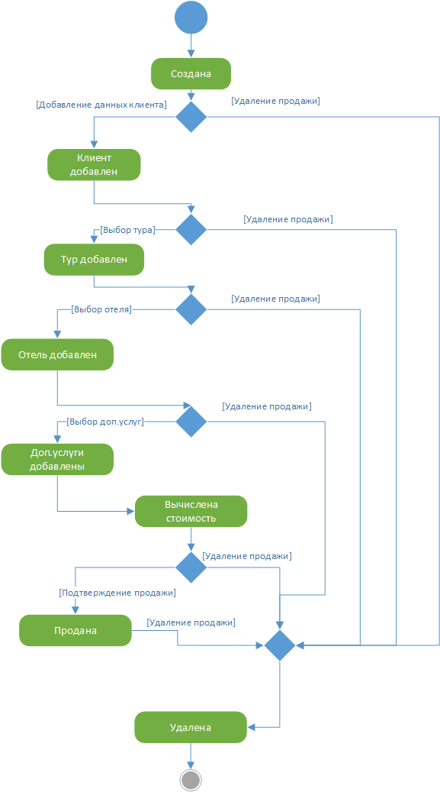

# Диаграмма состояний продажи

Диаграмма описывает все возможные состояния продажи на продолжении ее жиз-ненного цикла. Исходная продажа является пустой, далее, после добавления кли-ента, добавления тура, добавления отеля, добавления доп.услуг, определяется стоимость. После подтверждения всех аспектов продажа переходит в состояние «Продана». После этого она может быть удалена.